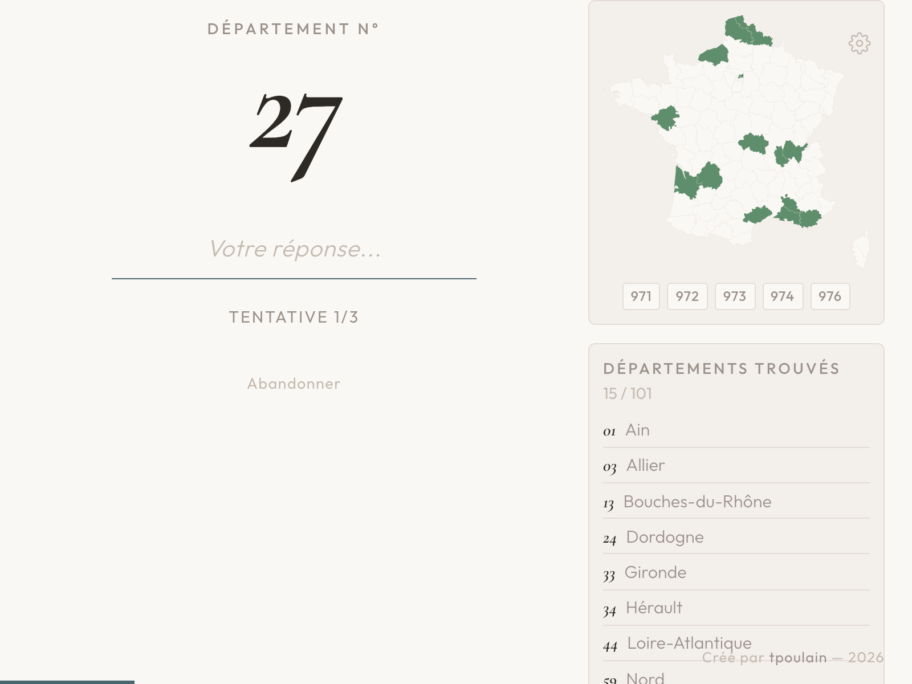
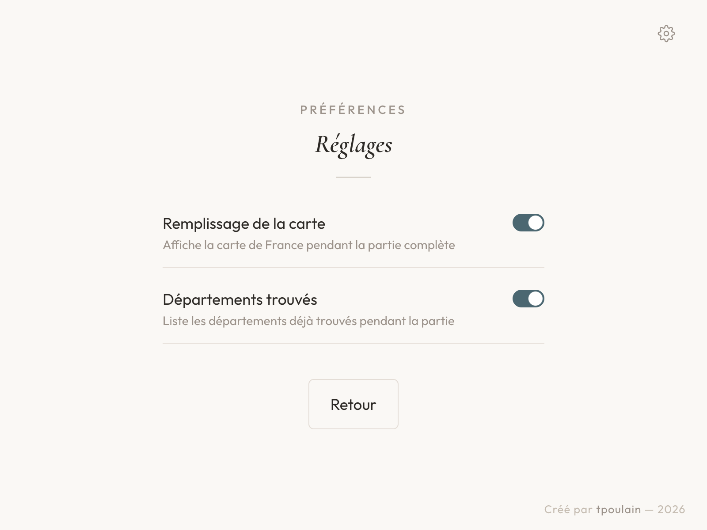
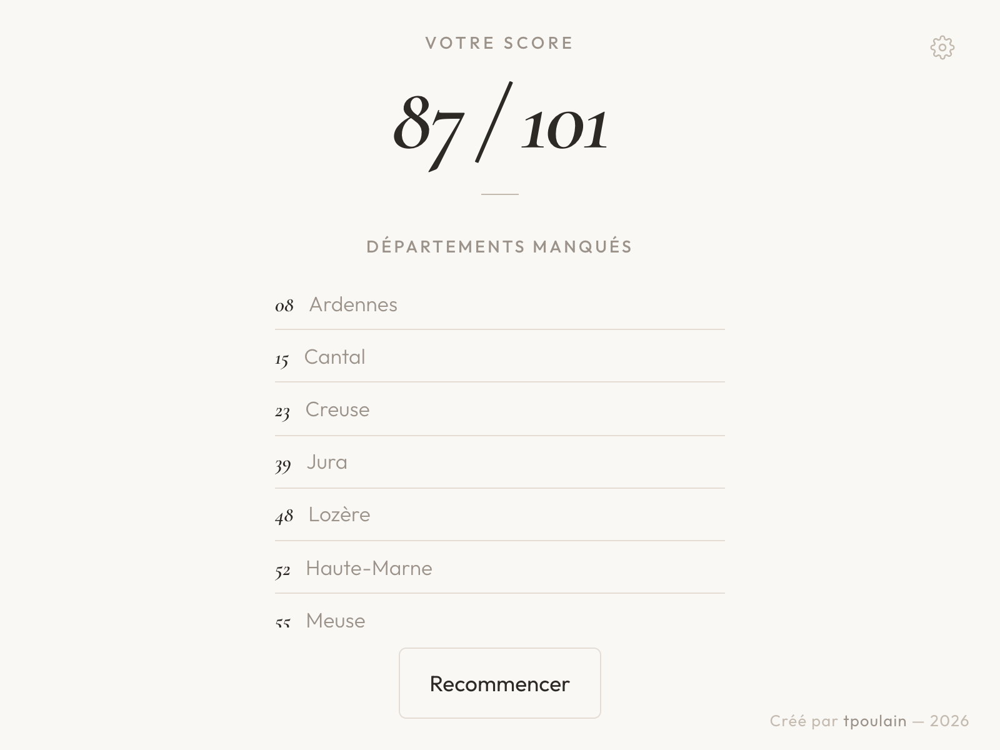

# Quiz Départements

Jeu de quiz pour tester vos connaissances sur les départements et préfectures de France.

👉 **[Jouer en ligne](https://jeudesdepartements.netlify.app/)**

## Aperçu

| Accueil | Partie en cours |
|:---:|:---:|
|  |  |

| Réglages | Résultats |
|:---:|:---:|
|  |  |

## Modes de jeu

**Départements** — Les 101 départements (métropole + DOM) dans un ordre aléatoire. Devinez le nom à partir du numéro. 3 tentatives par question.

**Préfectures** — Les 101 préfectures dans un ordre aléatoire. Devinez la préfecture à partir du nom du département. 3 tentatives par question.

**Question rapide** — Un département ou une préfecture au hasard, une seule question. Idéal pour s'entraîner rapidement.

## Fonctionnalités

- **Comparaison tolérante** : accents, tirets, apostrophes et majuscules sont ignorés. Les petites fautes de frappe sont acceptées grâce à la distance de Levenshtein (seuil de 2 caractères).
- **Séries (streaks)** : feedback visuel progressif sur les bonnes réponses consécutives. Série affichée à partir de 3, avec effets dorés et confettis à 10+. Meilleure série affichée dans les résultats.
- **Animations** : confettis sur bonne réponse (quantité et couleurs adaptées à la série en cours), shake rouge sur erreur, fade entre les questions.
- **Barre de progression** : barre fixée en bas de l'écran, pleine largeur, visible pendant toute la partie.
- **Écran de résultats** : score final, meilleure série et liste des réponses manquées pour réviser.
- **Carte de France** : carte SVG interactive qui colore les départements au fur et à mesure des bonnes réponses. Les DOM sont représentés par des badges sous la carte. Activable dans les réglages.
- **Liste des départements trouvés** : liste triée alphabétiquement des départements devinés avec compteur de progression. Activable dans les réglages.
- **Réglages** : accessible via l'icône engrenage en haut à droite. Permet d'activer/désactiver la carte et la liste. Les préférences sont sauvegardées dans le navigateur (localStorage).
- **Abandonner** : possibilité de quitter une partie en cours pour revenir à l'accueil.
- **Navigation mobile** : le bouton retour du navigateur ramène à l'écran précédent grâce à l'intégration de l'API History. Le clavier mobile affiche une touche de validation (coche) au lieu du retour à la ligne.

## Données

101 départements et leurs préfectures : 96 métropole (dont 2A Corse-du-Sud et 2B Haute-Corse) + 5 DOM (971 Guadeloupe, 972 Martinique, 973 Guyane, 974 La Réunion, 976 Mayotte).

## Tech

Un seul fichier `index.html`, zéro dépendance. HTML + CSS + JS vanilla. Polices Google Fonts (Cormorant Garamond + Outfit). Carte SVG issue de `@svg-maps/france.departments` (CC-BY 4.0).
